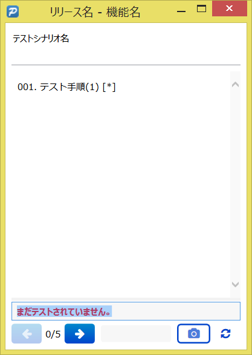

Prompit
=======

Prompit は JUnit形式のXMLレポートを出力できる、手動テスト支援ツールです。

[English](./README.md)

機能
----
*   Markdown 形式で記述したシナリオを見ながらテストが実行できる。
*   JUnit 形式の XML ファイルでテスト結果を出力できる（CIツール用）。
*   HTML ファイルでテスト結果を出力できる（ヒト用）。


必須ソフトウェア
----------------
*   .NET Framework 4.0 以上。


ダウンロード
------------
*   [http://xpfriend.com/prompit/Prompit-1.1.zip](http://xpfriend.com/prompit/Prompit-1.1.zip)


利用方法
--------
### 1. UTF-8 エンコーディングのテキストファイルを作成し、以下のような Markdown 形式でテストシナリオを記述する。

````
リリース名
==========

機能名
------
機能説明

### テストシナリオ名
テストシナリオ説明

1.  テスト手順(1) [*]
2.  テスト手順(2)
3.  ...

### テストシナリオ名
テストシナリオ説明

1.  テスト手順(1)
2.  ...
````

*   テストシナリオ名とテスト手順は必須。他は任意。
*   テスト手順に [*] と書くと自動でスクリーンショットが取得できる。


### 2. "Prompit.exe" を実行する


### 3. テストシナリオファイルを開く


### 4. テストを実行する
1.  Prompit のウインドウ上に表示されたテスト手順を実行する。
2.  実行したテストが失敗したら、失敗状況説明をテキストフィールドに記述して「次へ」ボタンをクリックする。
3.  実行したテストが成功したら、テキストフィールドをクリアして「次へ」ボタンをクリックする。




### 5. レポートファイルを利用する

#### JUnit 形式 XML ファイル

JUnit 形式 XML ファイルは `TestResults\[scenario file name].xml` として作成される。

#### HTML ファイル

HTML ファイルは `TestResults\[scenario file name]\index.html` として作成される。

    Folder
    │  test-scenario-01.md         ... テストシナリオファイル
    │
    └─TestResults
        │  test-scenario-01.xml    ... JUnit 形式 XML ファイル
        │
        └─test-scenario-01
            │  index.html          ... HTML ファイル
            │
            ├─css
            ├─fonts
            └─js


Jenkins からの利用
------------------
以下のように設定すると、Jenkins から Prompit を起動して利用することができます。

1.  「実行するノードを制限」にチェックを入れ、Windows スレーブの名前を入力する。
2.  作成したテストシナリオファイルをチェックアウトできるように「ソースコード管理」の設定を行う。
3.  「ビルド」に「Windowsバッチコマンドの実行」を追加して、「コマンド」欄に以下のような記述を行う。

        C:\Apps\Prompit\Prompit.exe test-scenario-01.md

4.  「ビルド後の処理」に「JUnitテスト結果の集計」を追加し、
    「テスト結果XML」に `TestResults/*.xml` と入力する。

HTML レポートを Jenkins から参照したい場合は、以下のように設定する。

1.  [HTML Publisher Plugin](https://wiki.jenkins-ci.org/display/JENKINS/HTML+Publisher+Plugin) 
    をインストールする。
2.  「ビルド後の処理」に「Publish HTML reports」を追加し、
    「TestResults/test-scenario-01」を「HTML directory to archive」欄に入力する。

ライセンス
----------
*   このソフトウェアのライセンスは MIT です。
*   このソフトウェアには以下のサードパーティ製ソフトェアが含まれています。

<table>
<tr><th>名前</th><th>ライセンス</th></tr>
<tr><td><a href="http://getbootstrap.com/">Bootstrap</a></td><td><a href="https://github.com/twbs/bootstrap/blob/master/LICENSE">MIT License</a></td></tr>
<tr><td><a href="http://docs.castleproject.org/">Castle.Core</a></td><td><a href="http://www.apache.org/licenses/LICENSE-2.0.txt">Apache License, Version 2.0</a></td></tr>
<tr><td><a href="http://fortawesome.github.io/Font-Awesome/">Font Awesome</a></td><td><a href="http://fortawesome.github.io/Font-Awesome/license/">SIL OFL 1.1</a></td></tr>
<tr><td><a href="http://htmlagilitypack.codeplex.com/">Html Agility Pack</a></td><td><a href="http://htmlagilitypack.codeplex.com/license">Microsoft Public License Ms-PL</a></td></tr>
<tr><td><a href="http://jquery.com/">jQuery</a></td><td><a href="https://jquery.org/license/">MIT License</a></td></tr>
<tr><td><a href="http://www.toptensoftware.com/markdowndeep/">MarkdownDeep</a></td><td><a href="http://www.toptensoftware.com/markdowndeep/license">Apache License, Version 2.0</a></td></tr>
<tr><td><a href="https://github.com/TestStack/White">TestStack.White</a></td><td><a href="https://github.com/TestStack/White/blob/master/LICENSE.txt">Apache License, Version 2.0 / MIT License</a></td></tr>
</table>


