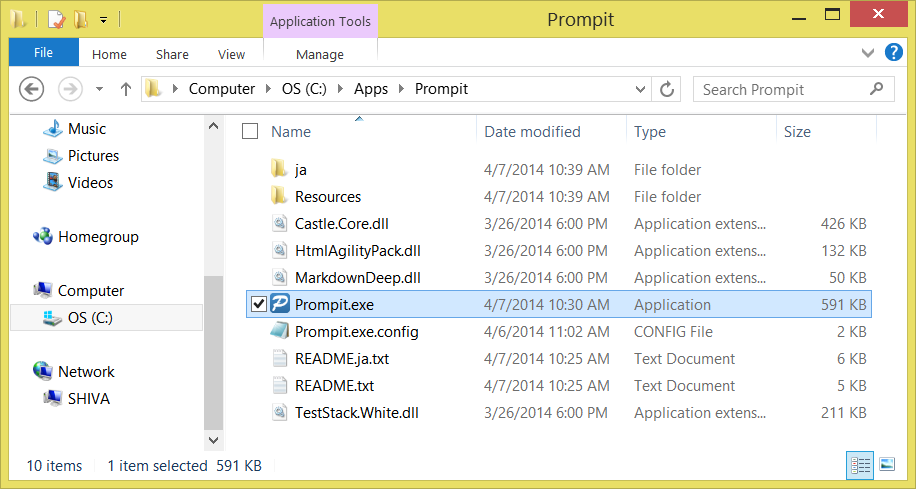
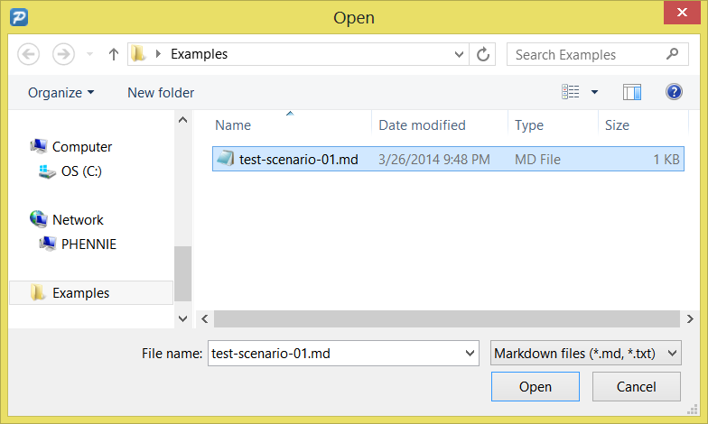
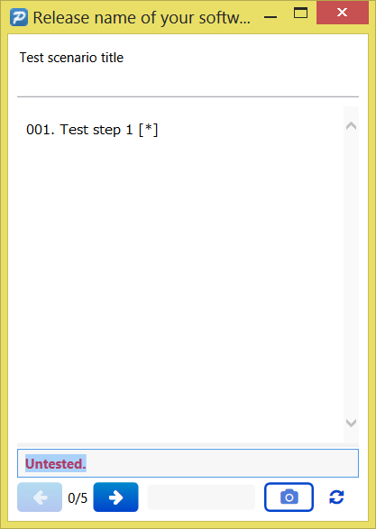

Prompit
=======

Prompit is a manual testing tool that can generate JUnit format XML reports.

[日本語](./README.ja.md)

Feature
-------
*   It can display a test scenario that is written by Markdown format.
*   For CI tools, it can output a report as a JUnit format XML file.
*   For humans, it can output an HTML report file.


Requirement
-----------
*   .NET Framework 4.0 or greater.


Download
--------
*   [http://xpfriend.com/prompit/Prompit-1.0.zip](http://xpfriend.com/prompit/Prompit-1.0.zip)


How to use
----------
### 1. Create a UTF-8 text file, and write test scenarios by Markdown format like this:

````
Release name of your software
=============================

Feature
-------
Feature description

### Test scenario title
Test scenario description

1.  Test step 1 [*]
2.  Test step 2
3.  ...

### Test scenario title

1.  Test step 1
2.  ...
````

*   `Test scenario title` and `Test step` are required.
*   If test step description has a `[*]`, then Prompit takes a screenshot automatically.


### 2. Run "Prompit.exe"




### 3. Open a test scenario file




### 4. Do the tests
1.  Do the step that is displayed on the Prompit Window.
2.  If the test failed, write details of the incident in the text field and click NEXT button.
3.  If the test is successful, clear the text field and click NEXT button.




### 5. Use report files

#### JUnit format XML file

The JUnit format XML file is created as `TestResults\[scenario file name].xml`.

#### HTML file

The HTML file is created as `TestResults\[scenario file name]\index.html`.

    Folder
    │  test-scenario-01.md         ... Test scenario file
    │
    └─TestResults
        │  test-scenario-01.xml    ... JUnit format XML file
        │
        └─test-scenario-01
            │  index.html          ... HTML file
            │
            ├─css
            ├─fonts
            └─js


With Jenkins
------------

You can call Prompit from Jenkins, when you configure the job like this:

1.  Check "Restrict where this project can be run" and input Windows Slave name.
2.  Configure "Source Code Management" to check out your test scenario file.
3.  Add "Execute Windows batch command" to "Build", and input command like this:

        C:\Apps\Prompit\Prompit.exe test-scenario-01.md

4.  Add "Publish JUnit test result report" to "Post-build Actions", 
    and input `TestResults/*.xml` to "Test report XMLs" field.

To see the HTML report: 

1.  Install [HTML Publisher Plugin](https://wiki.jenkins-ci.org/display/JENKINS/HTML+Publisher+Plugin).
2.  Add "Publish HTML reports" to "Post-build Actions" and input "TestResults/test-scenario-01" to 
    "HTML directory to archive".


License
-------
*   The software is released under the MIT License.
*   The software depends on the following 3rd party libraries.

<table>
<tr><th>Name</th><th>License</th></tr>
<tr><td><a href="http://getbootstrap.com/">Bootstrap</a></td><td><a href="https://github.com/twbs/bootstrap/blob/master/LICENSE">MIT License</a></td></tr>
<tr><td><a href="http://docs.castleproject.org/">Castle.Core</a></td><td><a href="http://www.apache.org/licenses/LICENSE-2.0.txt">Apache License, Version 2.0</a></td></tr>
<tr><td><a href="http://fortawesome.github.io/Font-Awesome/">Font Awesome</a></td><td><a href="http://fortawesome.github.io/Font-Awesome/license/">SIL OFL 1.1</a></td></tr>
<tr><td><a href="http://htmlagilitypack.codeplex.com/">Html Agility Pack</a></td><td><a href="http://htmlagilitypack.codeplex.com/license">Microsoft Public License Ms-PL</a></td></tr>
<tr><td><a href="http://jquery.com/">jQuery</a></td><td><a href="https://jquery.org/license/">MIT License</a></td></tr>
<tr><td><a href="http://www.toptensoftware.com/markdowndeep/">MarkdownDeep</a></td><td><a href="http://www.toptensoftware.com/markdowndeep/license">Apache License, Version 2.0</a></td></tr>
<tr><td><a href="https://github.com/TestStack/White">TestStack.White</a></td><td><a href="https://github.com/TestStack/White/blob/master/LICENSE.txt">Apache License, Version 2.0 / MIT License</a></td></tr>
</table>
